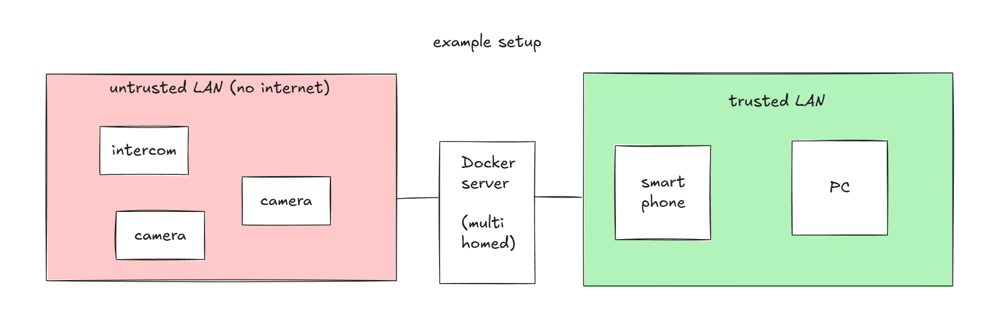

# hikvision-home

Two small self-hosted apps for a Hikvision intercom at a gate or front door:
one app to monitor the house cameras, and open or close the gate. And a second app is responsible for handing out QR codes to people who should be
able to let themselves in. So you can generate a qr code for a visitor with time or date restrictions, and if they hold it in front of the intercom and it is valid, the gate will open.

No cloud, no vendor app, no account. Everything runs in Docker on your own
box, and the credentials for your door hardware never leave it.



| App | What it does |
| --- | --- |
| [`intercom/`](intercom) | A phone-friendly page with live video from the intercom and up to two more cameras, and one hold-to-open gate button. Every press is logged. |
| [`gatekeys/`](gatekeys) | Issues printable QR codes that open the gate on a schedule — "Tuesdays 07:15–13:00 until March" — and answers the intercom app's one question: *may this code open the gate right now?* |

They are independent. Run `intercom` on its own and you have the camera view
and the button; add `gatekeys` when you want codes. If `gatekeys` is down,
codes stop working and the button does not. It never fails open.

```
   phone on your LAN
          │ https
          ▼
   reverse proxy (TLS, LAN-only)
          │
          ├──▶ intercom-app ──ws──▶ go2rtc ──rtsp──▶ intercom + cameras
          │         │
          │         ├── ISAPI digest PUT ──▶ the gate relay
          │         │
          │         └── POST /api/verify ──▶ gatekeys ──▶ SQLite
          │                  ▲
          └──▶ gatekeys ─────┘  (the page that hands out the codes)
```

## What you need

- A **Hikvision intercom or door station** reachable over IP, with an ISAPI
  account and RTSP enabled. `tools/probe.py` tells you what yours actually
  supports before you configure anything.
- **Docker** with the Compose plugin, on anything that can reach the device —
  a NAS, a mini PC, a Raspberry Pi 4 or better.
- Optionally up to **two more cameras** with an RTSP stream. They do not have
  to be Hikvision; see [docs/CAMERAS.md](docs/CAMERAS.md).
- Optionally **[Frigate](https://frigate.video) and an MQTT broker**, if you
  want the QR scanner. Frigate is what tells the app that someone is standing
  at the gate; without it the scanner stays off and everything else works.
- A **reverse proxy** in front of it, restricted to your LAN. Both apps
  deliberately expect to be shielded — read [SECURITY.md](SECURITY.md).

## Quick start

```sh
git clone https://github.com/gdoct/hikvision-home.git
cd hikvision-home
./build.sh setup          # creates both .env files and the shared secret
$EDITOR intercom/.env     # the device address and an ISAPI account
$EDITOR gatekeys/.env     # a username and password for the key GUI
./build.sh check          # says what is still missing, changes nothing
./build.sh probe          # asks the device which door and stream paths exist
./build.sh up             # builds and starts both apps
```

Then open `http://<your-host>:8099` for the gate page and
`http://<your-host>:8097` for the key GUI — and put a LAN-only reverse proxy
in front of both before you use them in earnest.

`./build.sh` with no arguments lists every command. Full walkthrough:
[docs/INSTALL.md](docs/INSTALL.md).

## What it does

**The gate page.** Live video with about one to two seconds of latency (MSE
over WebSocket, proxied so everything is same-origin). One camera fills the
screen; two or three arrive as a grid you can tap into. Landscape gives you
full-screen video with the button floating over it, and you can swipe between
cameras. It installs to a phone home screen as a normal-looking app.

**The button.** Hold for one second — a tap does nothing, because a mis-tap on
a phone should not open the gate to the street. A server-side cooldown and
rate limits stop double-taps and hammering. The result is reported honestly:
"signal sent" means the intercom accepted the command and pulsed its relay,
which is all any of this can know. The gate's actual position is never
claimed, because it cannot be read — the video is the truth.

**The log.** Every attempt is one JSON line with timestamp, source IP, user
agent and outcome. With no login in front of the page, that log is the only
way to answer "who opened the gate at ten past two".

**The codes.** A key is a name, a date range, weekly windows on a 15-minute
grid, an optional use limit and a cooldown. It prints as an A6 card with the
QR at 40 mm, the code in text, and the schedule written out, so a card found
in a drawer two years later explains itself. Revoking is one click and keeps
the history. Measured at a real gate, a 25 mm code covering 61x54 px in frame
still decoded — 40 mm leaves room for bad light and a moving hand.

**The scanner.** It only runs while Frigate reports a person at the camera,
decodes at 8 fps, asks gatekeys about anything it reads, and opens the gate
under the same lock and cooldown as the button. It never decides anything
itself, and it never learns which codes exist — only the verdict on the one
in front of the lens.

## Security, in one paragraph

These apps open a physical gate. The page has **no authentication at all**:
anything on your LAN that can reach it can open your gate, by design — that
is the whole point of a page you can open from the couch without logging in.
Everything protecting it is outside the app: no public DNS, no port forward,
a reverse proxy with a LAN-only access list, and a network that keeps your
cameras from reaching it. If you want it from outside the house, use a VPN
into the LAN. Do not add a login to this and call it internet-safe.
[SECURITY.md](SECURITY.md) spells all of this out, including what to do when
you think you have found a hole.

## Documentation

| | |
| --- | --- |
| [docs/INSTALL.md](docs/INSTALL.md) | Full installation, from a bare Docker host to a working gate button |
| [docs/ARCHITECTURE.md](docs/ARCHITECTURE.md) | How the pieces fit, and why it is two services and not one |
| [docs/CAMERAS.md](docs/CAMERAS.md) | RTSP paths per brand, adding cameras, going past three |
| [SECURITY.md](SECURITY.md) | The threat model, the rules, and how to report a vulnerability |
| [CONTRIBUTING.md](CONTRIBUTING.md) | How to run it locally, the house style, what a good PR looks like |
| [intercom/README.md](intercom/README.md) | The gate app in detail: API, QR scanning, behaviour notes |
| [gatekeys/README.md](gatekeys/README.md) | The key app in detail: what a key is, the verify contract |

## Status and scope

This runs at one house, on one intercom, every day. It is a home project
shared in the hope that it saves someone else the same evening of ISAPI
guesswork — not a product, and there is no warranty (see [LICENSE](LICENSE)).

Deliberately not included: two-way audio, answering intercom calls, recording
or motion history (Frigate does that far better), any form of remote access,
and per-person logins. Issues and pull requests are welcome, especially
reports from Hikvision models other than the one this was built against.

## License

[MIT](LICENSE).
